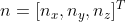
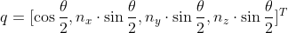
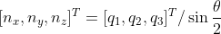
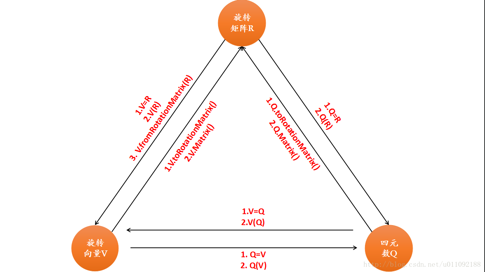

# Eigen中常用的变量

typedef | 名称 | 形式
----|----|----
Eigen::Matrix3d | 旋转矩阵 | 3-by-3
Eigen::AngleAxisd | 旋转向量 | 3-by-1
Eigen::Quaterniond | 四元素 | 4-by-1
Eigen::Vector3d | 平移向量 | 3-by-1
Eigen::Isometry3d | 欧式变换矩阵 | 4-by-4

## AngleAxis

Angle + Axis，Angle代表旋转角，Axis代表旋转轴，用绕任意的旋转轴旋转一个角度来表示3D旋转。

### 构造函数

形式1: Eigen::AngleAxis::AngleAxis(const Scalar &angle, const MatrixBase<Derived> &axis)

注意：
- angle是in radian，例如 M_PI/4
- axis必须是归一化的，Vector3d(0, 0, 1)，这就是归一化的

## 四元数(Quaternion)

https://www.euclideanspace.com/maths/algebra/realNormedAlgebra/quaternions/index.htm

与旋转矩阵类似，我们仍然假设某个旋转是绕单位向量进行了角度为th的旋转，那么这个旋转的四元数形式为：

旋转轴为(0,0,1)，旋转角度th为45度，那么对应的四元数的表示形式为：

nx * sin(22.5deg) = 0

ny * sin(22.5deg) = 0

nz * sin(22.5deg) = 0.382683

cos(22.5deg) = 0.923880

sqrt(0.382683) + sqrt(0.923880) = 1

想想直角三角形，sqrt(sin(th)) + sqrt(cos(th)) = 1

对于长度为1的四元数，根据四元数的coeffs，推导出旋转轴和旋转角的公式如下：

cos(th/2) = q0，于是th = 2 * arccos(q0)，现在q0=0.923880，于是th=45deg
nx = qx / sin(th/2), ny = qy / sin(th/2), nz = qz / sin(th/2)

若某个四元数的长度不为1，我们可以通过归一化将它转换成模长为1的四元数。

## 欧拉角

https://www.euclideanspace.com/maths/geometry/rotations/euler/index.htm

Angles | 约定的说法
----|----
Angle applied first | heading
Angle applied second | attitude
Angle applied last | bank

欧拉角是多个旋转（绕不同的旋转轴）组合到一起的，旋转的顺序不同，旋转结果是不一样的。

举个例子，

A:
- a1: 绕x轴旋转90deg
- a2: 绕y轴旋转90deg
- a3: 绕x轴旋转-90deg

结果：绕z轴旋转90deg

B:
- b1: 绕x轴旋转90deg
- b2: 绕x轴旋转-90deg
- b3: 绕y轴旋转90deg

结果：绕y轴旋转90deg

一共有12种不同旋转顺序的组合

- xyz
- yzx
- zxy
- zyx
- xzy
- yxz

# Eigen中不同旋转方法之间的转换

3D空间中的变换：

## 四元数转欧拉角

两个不错的在线转换工具：

https://www.andre-gaschler.com/rotationconverter/

https://quaternions.online/

变换类型|说明
----|----
欧式变换 | 无